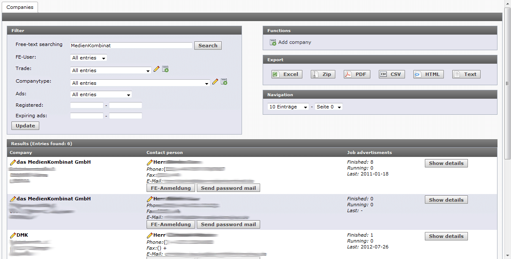

.. ==================================================
.. FOR YOUR INFORMATION
.. --------------------------------------------------
.. -*- coding: utf-8 -*- with BOM.

Export handler
==============

The export handler can be included in every backend module. It offers export function
for the current view indluding the configured filters.

For that you have to create an instance of the handler passing he current module.

The module has to implement the special interface tx_mklib_mod1_export_IModFunc.
You than have to provide the functions  getConfID, getModule and getSearcher. If it
is a rn_base based module you only need to provide the getSearcher method.

The getSearcher method has to return an instance of tx_mklib_mod1_export_ISearcher. This one
has to provide the method getInitialisedListProvider which should return provider for the list builder.
If the abstract search class of mklib is used everything is fine already.

The handler offers 2 public methods.

**parseTemplate**

Reads the TypoScript configuration and creates the export buttons. Provides the marker
###EXPORT_BUTTONS### to be included in the module template.

**handleExport**

Checks whether an export was triggered and takes care of that.

**Different exports for the same list**

By adding more types and different templates/marker classes it is possible to have different exports
for a file format, let's say Excel. The type excelsimple could be a simple list of companies. The type
exceldetails could be an advanced list with more information.

Example implementation
----------------------

.. code-block:: php

   protected function showSearch($template, $configurations, $formTool, &$markerArray) {
      /* @var $exportHandler tx_mklib_mod1_export_Handler */
      $exportHandler = tx_rnbase::makeInstance(
            'tx_mklib_mod1_export_Handler', $this
      );
      // check for exports
      $exportHandler->handleExport();
      // parse template
      $template = $exportHandler->parseTemplate($template);

      $searcher = $this->getSearcher();
      $markerArray['###SEARCHFORM###'] = $searcher->getSearchForm();
      $data = $searcher->getResultList();
      $markerArray['###LIST###'] = $data['table'];
      $markerArray['###SIZE###'] = $data['totalsize'];
      $markerArray['###PAGER###'] = $data['pager'];
      $out = tx_rnbase_util_Templates::substituteMarkerArrayCached($template, $markerArray);
      return $out;
   }

Don't forget to include the marker ###EXPORT_BUTTONS### in your module template.

Configuration through TypoScript
--------------------------------

This configuration gives the possibility to download the currently displayed list in the backend
module as Excel and CSV file.

.. code-block:: ts

   mod {
      mkextension {
         funcmodule {
            template = EXT:mkextension/mod1/templates/funccompanies.html
            export.types {
               excel {
                  ### label of the button, possible, too: ###LABEL_*
                  label = Excel
                  ### description for tool tip when hovering over button. possible, too: ###LABEL_*
                  description = Your descriptive text
                  ### a sprite icon known by TYPO3 @see tx_rnbase_mod_Util::debugSprites
                  spriteIcon = mimetypes-excel
                  ### configuration for the template
                  template {
                     ### path to template
                     template = EXT:mkextension/mod1/templates/export/data.xls
                     ### you can also use a USER Func or every other TypoScript.
                     ### When using a userFunc you have to take care yourself to load the class
                     ### as filename.includeLibs = EXT:myext/Classes/Utility/Backend.php works not
                     ### in the backend. You can do this via autoload or just call
                     ### tx_rnbase::load('Tx_Myext_Utility_Backend') before the PageTS Config file
                     ### which includes this TypoScript is loaded.
                     #filename = USER
                     #filename.userFunc = Tx_Myext_Utility_Backend->getFileNameForExport
                     ### marker for the subpart
                     subpart = ###DATALIST###
                     ### item path Pfad. user for the configuration ID (lowercase)
                     ### and the marker name (uppercase). Default is item
                     itempath = data
                     ### marker class, which renders the data. Default is tx_rnbase_util_SimpleMarker
                     markerclass = tx_mkextension_marker_Data
                  }
                  ### Header configuration. Is sent during exports.
                  headers {
                     filename = data.xls
                     contenttype = application/vnd.ms-excel
                     additional {
                        ### results in "location: http://www.example.de/"
                        #location = http://www.example.de/
                     }
                  }
               }
               csv < .excel
               csv {
                  label = CSV
                  spriteIcon = mimetypes-text-csv
                  template {
                     template = EXT:mkextension/mod1/templates/export/data.csv
                  }
                  headers {
                     filename = companies.csv
                     contenttype = text/csv
                  }
               }
            }
         }
      }
   }

The TypoScript configuration ID to configure the marker class is in this case funcmodule.data

Debugging
---------
Debug data of the export process can be included with the subpart ###DEBUG### in the module template.
This is appended to the output.

Example:

.. code-block:: html

   <!-- ###DEBUG### -->
   <!--
      Date:            ###DEBUG_DATE###         > 2013-02-22T16:22:14+01:00
      Item Count:      ###DEBUG_ITEMCOUNT###    > 2553
      Execution Time:  ###DEBUG_PARSETIME###    > 270.1039788723
      Memory Consumed: ###DEBUG_MEMUSED###      > 15809480
      Memory Start:    ###DEBUG_MEMSTART###     > 25496712
      Memory End:      ###DEBUG_MEMEND###       > 41306192
    -->
   <!-- ###DEBUG### -->

Performance
-----------
To hit memory limits not during large exports a special list builder was developed. This
one doesn't render the complete template and than sents it to the browser. Instead the data is
directly sent to the browser and memory is freed up.
Nothing the less script execution timeouts can happen. But this depends on the marker classes and the
complexity of data. For the export the limit should be deactivated or raised.